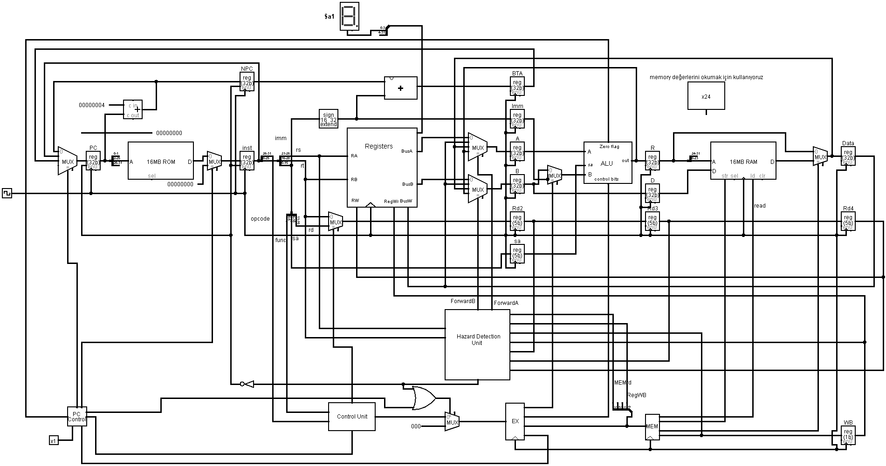

# Pipelined CPU Design

This project implements a **32-bit 5-stage pipelined CPU** designed in Logisim. It follows a classic RISC-style architecture to process instructions efficiently through parallel stages.

## Technical Specifications

The processor is divided into five pipeline stages to handle instruction flow: **Fetch (IF), Decode (ID), Execute (EX), Memory (MEM), and Write Back (WB)**.

### Core Components
*   **Control Unit:** Uses a ROM-based structure to generate 12-bit control signals based on Opcode and Function codes. It determines operations like ALU functions, memory access, and register writes.
*   **ALU (Arithmetic Logic Unit):** Performs operations including Addition, Subtraction, Negation, AND, OR, XOR, NOT, and logical shifts (Left/Right).
*   **Register File:** Contains 32 registers, each 32 bits wide. **R0** is hardwired to zero.
*   **Hazard Detection Unit:** Manages data hazards by implementing **forwarding** and **stalling** (bubbles) to ensure data integrity when instructions depend on previous results.
*   **PC Control:** Manages program flow by handling Jumps and Branches (BEQ, BNE). It also generates "kill" signals to flush instructions when a branch is taken.

### Pipeline Stages
1.  **Instruction Fetch (IF):** Increments the Program Counter (PC) and fetches the next instruction from ROM.
2.  **Instruction Decode (ID):** Decodes the instruction, reads the register file, and extends immediate values.
3.  **Execute (EX):** Performs the required ALU operation and calculates branch target addresses.
4.  **Memory Access (MEM):** Interacts with RAM for Load/Store operations.
5.  **Write Back (WB):** Writes the final result (from ALU or RAM) back into the register file.

## Project Structure

*   `CPU.circ`: The main Logisim circuit file (located in the root directory).
*   `sources/`: Contains project documentation and technical reports.
*   `galery/`: Contains detailed images of the individual sub-circuits and the main processor.

## Usage
To view or simulate the circuit, open the `CPU.circ` file using **Logisim**. Instructions are manually loaded into the ROM in hexadecimal format. You can monitor the system state via the Hex Digit Display, which is configured to show specific register values during execution.
